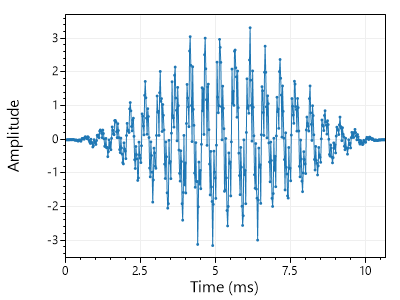
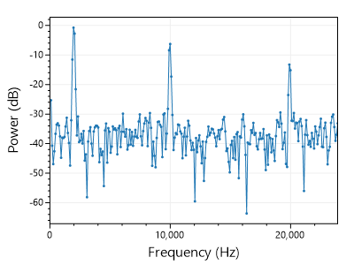
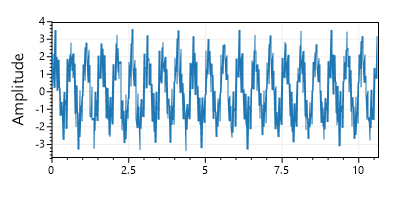
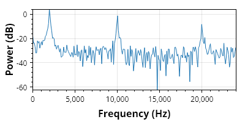
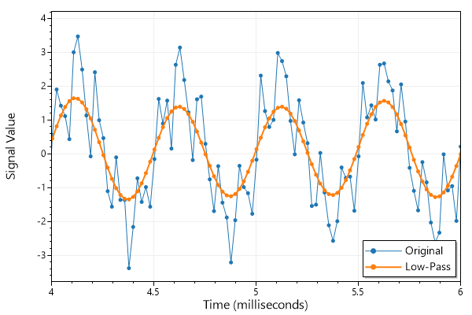
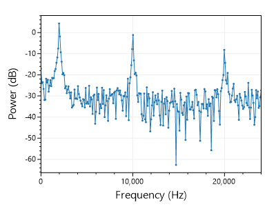
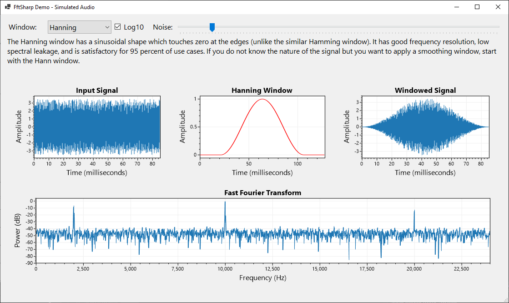
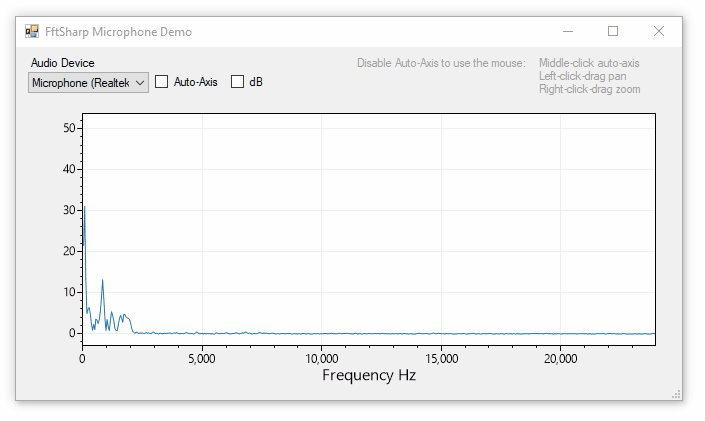

#  FftSharp

[](https://github.com/swharden/FftSharp/actions/workflows/ci.yaml)

**FftSharp is a collection of Fast Fourier Transform (FFT) tools for .NET.** FftSharp is provided under the permissive [MIT license](LICENSE) so it is suitable for use in commercial applications. FftSharp targets .NET Standard and has no dependencies so it can be easily used in cross-platform .NET Framework and .NET Core applications.

### Quickstart

```cs
// Begin with an array containing sample data
double[] signal = FftSharp.SampleData.SampleAudio1();

// Shape the signal using a Hanning window
var window = new FftSharp.Windows.Hanning();
window.ApplyInPlace(signal);

// Calculate the FFT as an array of complex numbers
System.Numerics.Complex[] spectrum = FftSharp.FFT.Forward(signal);

// or get the magnitude (units²) or power (dB) as real numbers
double[] magnitude = FftSharp.FFT.Magnitude(spectrum);
double[] power = FftSharp.FFT.Power(spectrum);
```

Signal | Windowed Signal | FFT
---|---|---
||

## Sample Data

```cs
// sample audio with tones at 2, 10, and 20 kHz plus white noise
double[] signal = FftSharp.SampleData.SampleAudio1();
int sampleRate = 48_000;
double samplePeriod = sampleRate / 1000.0;

// plot the sample audio
ScottPlot.Plot plt = new();
plt.Add.Signal(signal, samplePeriod);
plt.YLabel("Amplitude");
plt.SavePng("time-series.png",500,500);
```

<div align="center">



</div>

## Spectral Magnitude and Power Density

Most people performing FFT operations are interested in calculating magnitude or power of their signal with respect to frequency. Magnitude units are the square of the original units, and power is in decibels.

Frequency of each point is a linear range between zero and half the sample rage (Nyquist frequency). A helper function makes it easy to get an array of frequencies (Hz units) to match the FFT that was generated.

```cs
// sample audio with tones at 2, 10, and 20 kHz plus white noise
double[] signal = FftSharp.SampleData.SampleAudio1();
int sampleRate = 48_000;

// calculate the power spectral density using FFT
System.Numerics.Complex[] spectrum = FftSharp.FFT.Forward(signal);
double[] psd = FftSharp.FFT.Power(spectrum);
double[] freq = FftSharp.FFT.FrequencyScale(psd.Length, sampleRate);

// plot the sample audio
ScottPlot.Plot plt = new ScottPlot.Plot();
plt.AddScatterLines(freq, psd);
plt.YLabel("Power (dB)");
plt.XLabel("Frequency (Hz)");
plt.SaveFig("periodogram.png");
```

<div align="center">



</div>

## FFT using Complex Numbers

If you are writing a performance application or just enjoy working with real and imaginary components of complex numbers, you can build your own complex array perform FFT operations on it in place:

```cs
System.Numerics.Complex[] buffer =
{
    new(real: 42, imaginary: 12),
    new(real: 96, imaginary: 34),
    new(real: 13, imaginary: 56),
    new(real: 99, imaginary: 78),
};

FftSharp.Transform.FFT(buffer);
```

## Filtering

The `FftSharp.Filter` module has methods to apply low-pass, high-pass, band-pass, and band-stop filtering. This works by converting signals to the frequency domain (using FFT), zeroing-out the desired ranges, performing the inverse FFT (iFFT), and returning the result.

```cs
double[] audio = FftSharp.SampleData.SampleAudio1();
double[] filtered = FftSharp.Filter.LowPass(audio, sampleRate, maxFrequency: 2000);
```

<div align="center">



</div>

## Windowing

Signals are often _windowed_ prior to FFT analysis. Windowing is essentially multiplying the waveform by a bell-shaped curve prior to analysis, improving the frequency resolution of the FFT output.

<div align="center">


</div>

The Hanning window is the most common window function for general-purpose FFT analysis. Other window functions may have different _scallop loss_ or _spectral leakage_ properties. For more information review [window functions](https://en.wikipedia.org/wiki/Window_function) on Wikipedia.

```cs
double[] signal = FftSharp.SampleData.SampleAudio1();

var window = new FftSharp.Windows.Hanning();
double[] windowed = window.Apply(signal);
```

Hanning Window | Power Spectral Density
---|---
|

Windowing signals prior to calculating the FFT improves signal-to-noise ratio at lower frequencies, making power spectrum peaks easier to resolve.

No Window | Power Spectral Density
---|---
|

### Window Functions

This chart (adapted from [Understanding FFT Windows](https://www.egr.msu.edu/classes/me451/me451_labs/Fall_2013/Understanding_FFT_Windows.pdf)) summarizes windows commonly used for FFT analysis.

Window           | Use Case       | Frequency Resolution | Spectral Leakage | Amplitude Accuracy
-----------------|----------------|------|------|-----
Barlett          | Random         | Good | Fair | Fair
Blackman         | Random         | Poor | Best | Good
Cosine           | Random         | Fair | Fair | Fair
Flat Top         | Sine waves     | Poor | Good | Best
Hanning          | Random         | Good | Good | Fair
Hamming          | Random         | Good | Fair | Fair
Kaiser           | Random         | Fair | Good | Good
Rectangular      | Transient      | Best | Poor | Poor
Tukey            | Transient      | Good | Poor | Poor
Welch            | Random         | Good | Good | Fair

## Demo Application

A sample application is included with this project that interactively displays an audio signal next to its FFT using different windowing functions.

<div align="center">



</div>

### Microphone Demo

One of the demos included is a FFT microphone analyzer which continuously monitors a sound card input device and calculates the FFT and displays it in real time.



## Spectrogram

A spectrogram is a visual representation of the spectrum of frequencies of a signal as it varies with time. Spectrograms are created by computing power spectral density of a small window of an audio signal, moving the window forward in time, and repeating until the end of the signal is reached. In a spectrogram the horizontal axis represents time, the vertical axis represents frequency, and the pixel intensity represents spectral magnitude or power.

[**Spectrogram**](https://github.com/swharden/Spectrogram) is a .NET library for creating spectrograms.

<div align="center">


_I'm sorry Dave... I'm afraid I can't do that_

</div>
