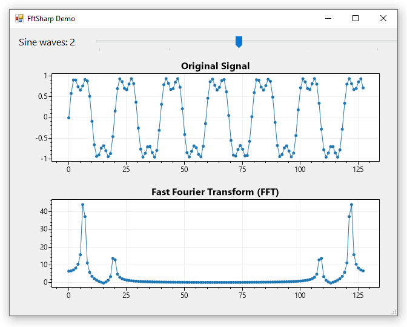
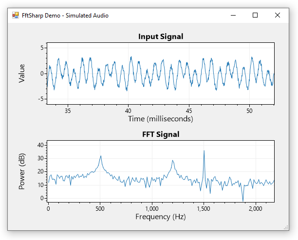

# FftSharp

**FftSharp is a collection of simple FFT and IFFT methods for .NET.** FftSharp is provided under the permissive [MIT license](LICENSE) so it is suitable for use in commercial products. FftSharp targets .NET Standard and it has no dependencies so it can be easily used in cross-platform .NET Framework and .NET Core applications.

<div align="center">



</div>

## Installation

FftSharp is available on NuGet:
* https://www.nuget.org/packages/FftSharp/

## Quickstart

> **⚠️ WARNING:** FftSharp is early in development and its public API may change as it matures.

`FFT()` can be run with `Complex[]` input, but an overload also accepts `double[]` and automatically generates the complex input with the input values assigned to the real component.

```cs
// create sample data containing two sine waves
double[] sampleData = new double[128];
for (int i = 0; i < sampleData.Length; i++){
    double wave1 = Math.Sin(i / Math.PI);
    double wave2 = Math.Sin(3 * i / Math.PI) * 0.333;
    sampleData[i] = wave1 + wave2;
}

// Calculate the FFT with FftSharp
Complex[] fft = FftSharp.Transform.FFT(sampleData);

// convert the output to Decibels for graphing
double[] fftPower = FftSharp.Convert.ToDecibelPower(fft);
```

## Simulate Audio Data

A demo application is included which simulates audio data by creating a 48kHz signal then letting the user add components to the signal such as noise and sine waves of various amplitudes.

```cs
int sampleRate = 48000;
int fftSize = 4096; // 2^12
double[] data = new double[fftSize];
data = FftSharp.SampleData.AddWhiteNoise(data, 1);

// add sine waves at 500, 1200, and 1500 Hz
data = FftSharp.SampleData.AddSin(data, sampleRate, 500, 1);
data = FftSharp.SampleData.AddSin(data, sampleRate, 1200, .5);
data = FftSharp.SampleData.AddSin(data, sampleRate, 1500, 2);
```

FftSharp makes it easy to obtain the FFT and convert it to Decibels:

```cs
Complex[] fft = FftSharp.Transform.FFT(data);
double[] fftPower = FftSharp.Convert.ToDecibelPower(fft);
```

Inspection of the output confirms peaks at the 3 expected frequencies.

<div align="center">



</div>
