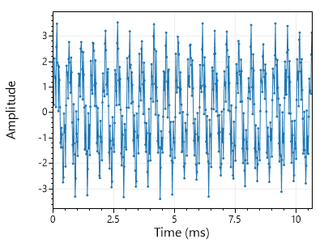
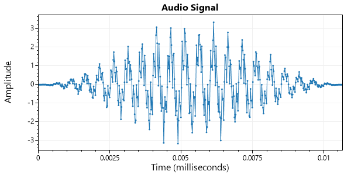
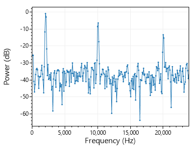
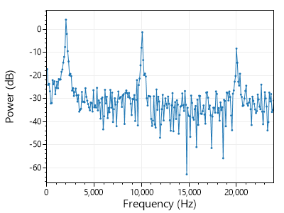
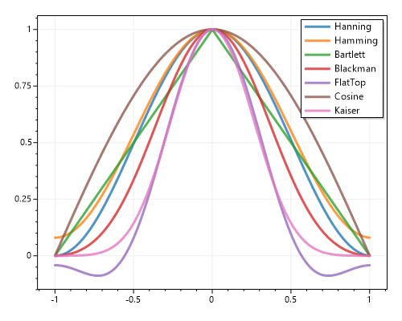
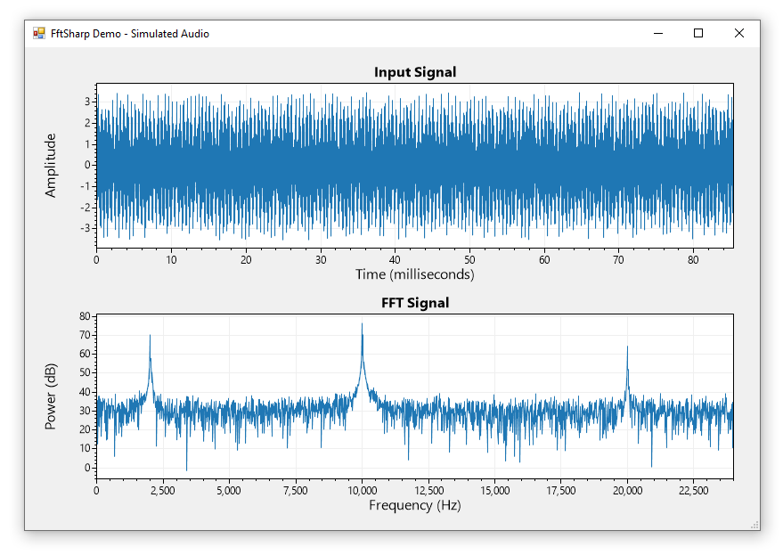
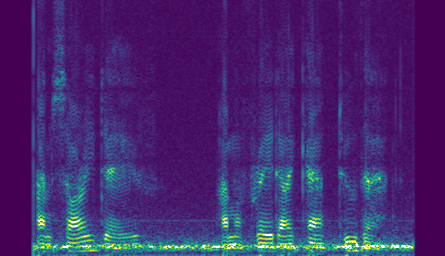

# FftSharp

[](https://dev.azure.com/swharden/swharden/_build/latest?definitionId=8&branchName=master)
[](https://www.nuget.org/packages/FftSharp/)

**FftSharp is a collection of Fast Fourier Transform (FFT) tools for .NET.** FftSharp is provided under the permissive [MIT license](LICENSE) so it is suitable for use in commercial applications. FftSharp targets .NET Standard and has no dependencies so it can be easily used in cross-platform .NET Framework and .NET Core applications.

### Quickstart

```cs
// Start with some data
double[] audio = FftSharp.SampleData.SampleAudio1();

// Window your signal
double[] window = FftSharp.Window.Hanning(audio.Length);
FftSharp.Window.ApplyInPlace(window, audio);

// Calculate power spectral density (dB)
double[] fftPower = FftSharp.Transform.FFTpower(audio);
```

Audio | Windowed | FFT
---|---|---
||

A quickstart application ([Program.cs](src/FftSharp.Quickstart/Program.cs)) demonstrates common FftSharp features. The quickstart program generates the graphs shown here, but plotting-related code has been omitted from these code samples.

## Usage

### Installation

FftSharp is available on NuGet:
* https://www.nuget.org/packages/FftSharp/


### Sample Data

```cs
// sample audio with tones at 2, 10, and 20 kHz plus white noise
double[] audio = FftSharp.SampleData.SampleAudio1();
int sampleRate = 48000;
```

<div align="center">


</div>

### Calculate the Power Spectral Density (PSD)

Most people interested in FFT software are attempting to calculate the [power spectral density (PSD)](https://en.wikipedia.org/wiki/Spectral_density) of a signal, usually reported in [dB](https://en.wikipedia.org/wiki/Decibel) units. Knowing this, FftSharp makes it easy to go straight from signal to power spectrum:

```cs
double[] fftPower = FftSharp.Transform.FFTpower(audio);
```

Knowing you're interested in how these data line-up with frequencies, we also make it easy to get the list of frequencies corresponding to each point on the power spectrum:

```cs
double[] freqs = FftSharp.Transform.FFTfreq(sampleRate, fftPower.Length);
```

Power vs. frequency can then be plotted to yield a [periodogram](https://en.wikipedia.org/wiki/Periodogram):

<div align="center">



</div>

### Calculate the FFT using Complex Numbers

If you enjoy working with real and imaginary components of complex numbers, you can build your own complex array and call `FFT()` directly. Unlike some FFT libraries which use their own complex number modules, FftSharp simply uses the [Complex struct](https://docs.microsoft.com/en-us/dotnet/api/system.numerics.complex) provided by the [standard Numerics .NET library](https://docs.microsoft.com/en-us/dotnet/standard/numerics).

```cs
// Start with some data
double[] audio = FftSharp.SampleData.SampleAudio1();

// convert the data to an array of complex numbers
Complex[] buffer = new Complex[audio.Length];
for (int i=0; i<buffer.Length; i++)
    buffer[i] = new Complex(audio[i], 0);

// compute the FFT in-place
FftSharp.Transform.FFT(buffer);
```

### Windowing

Signals are often are _windowed_ prior to FFT analysis. Windowing is essentially multiplying the waveform by a bell-shaped curve prior to analysis. The `FftSharp.Window` module provides easy access to many common window functions.

<div align="center">



</div>

The Hanning window is the most common window for general-purpose FFT analysis. Other window functions may have different _scallop loss_ or _spectral leakage_ properties. For more information review [window functions](https://en.wikipedia.org/wiki/Window_function) on Wikipedia.

```cs
// Apply a Hanning window to the audio prior to FFT analysis
double[] window = FftSharp.Window.Hanning(audio.Length);
FftSharp.Window.ApplyInPlace(window, audio);
```

Hanning Window | Power Spectral Density
---|---
|

Windowing signals prior to calculating the FFT improves signal-to-noise ratio at lower frequencies, making power spectrum peaks easier to resolve.

No Window | Power Spectral Density
---|---
|

## Demo Application

A graphical demo application is included in this project which uses [ScottPlot](https://swharden.com/scottplot/) to interactively display an audio signal next to its FFT.

<div align="center">



</div>

## Spectrogram

A spectrogram is a visual representation of the spectrum of frequencies of a signal as it varies with time. Spectrograms are created by computing power spectral density of a small window of an audio signal, moving the window forward in time, and repeating until the end of the signal is reached. In a spectrogram the horizontal axis represents time, the vertical axis represents frequency, and the pixel intensity represents spectral magnitude or power.

[Spectrogram](https://github.com/swharden/Spectrogram) is a .NET library for creating spectrograms.

<div align="center">



_I'm sorry Dave... I'm afraid I can't do that_

</div>
